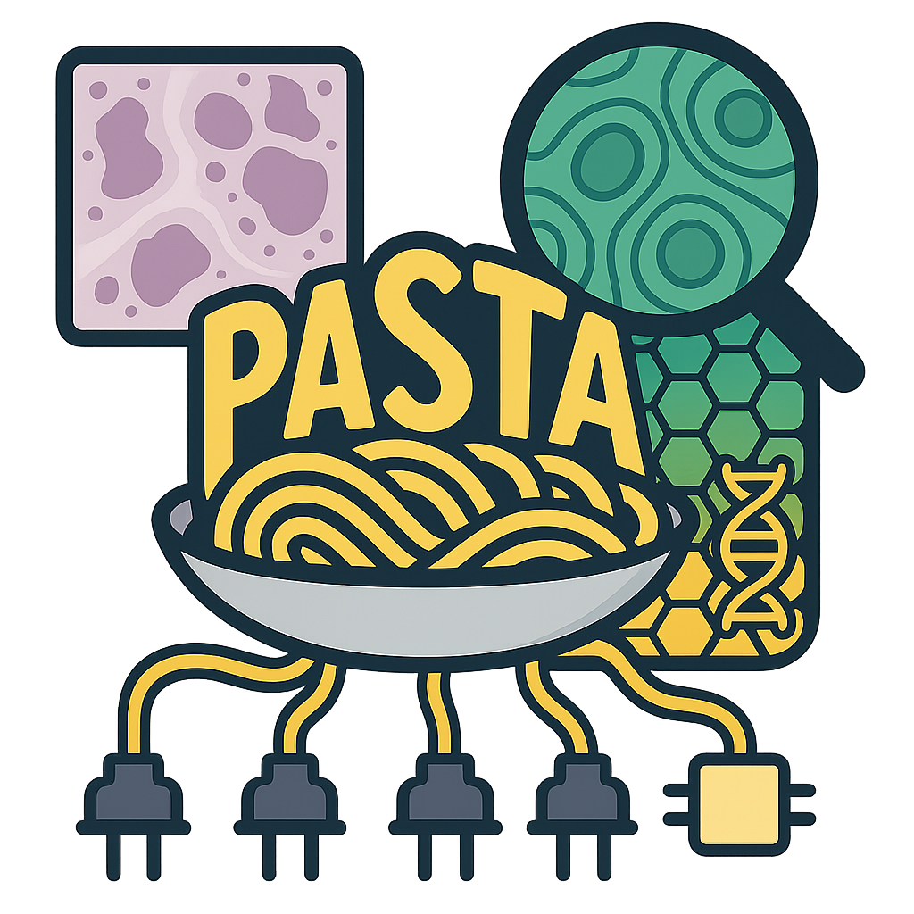
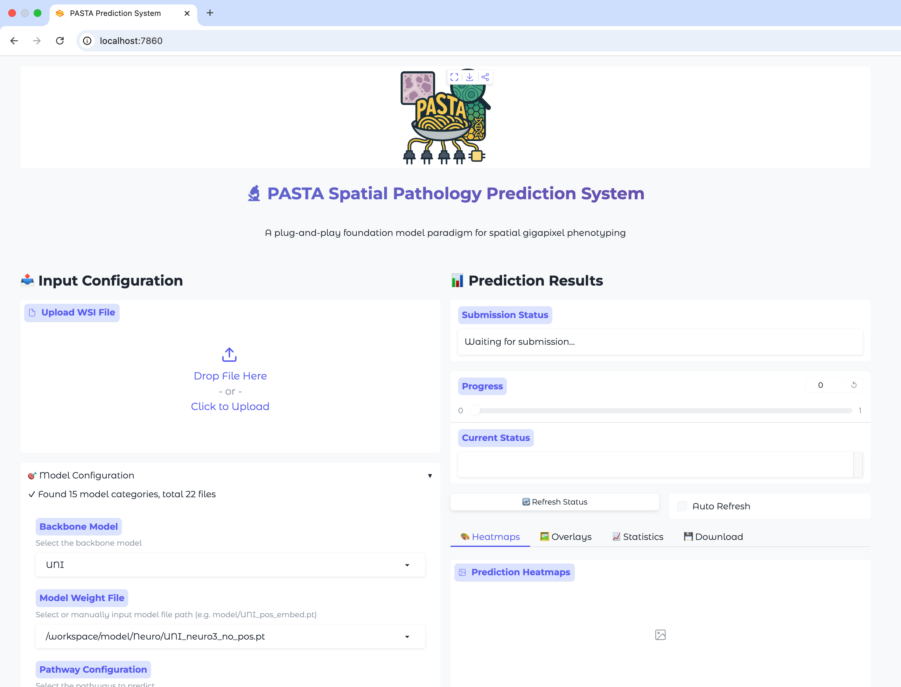
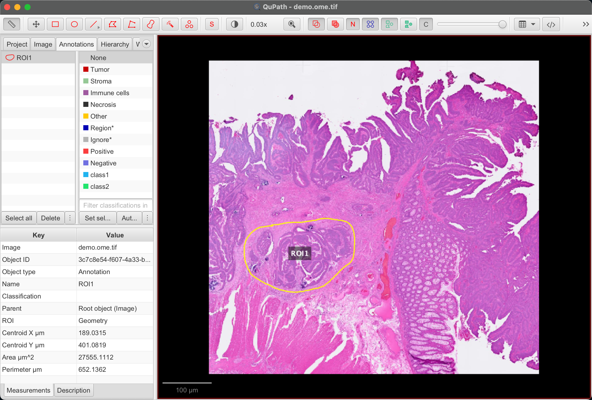
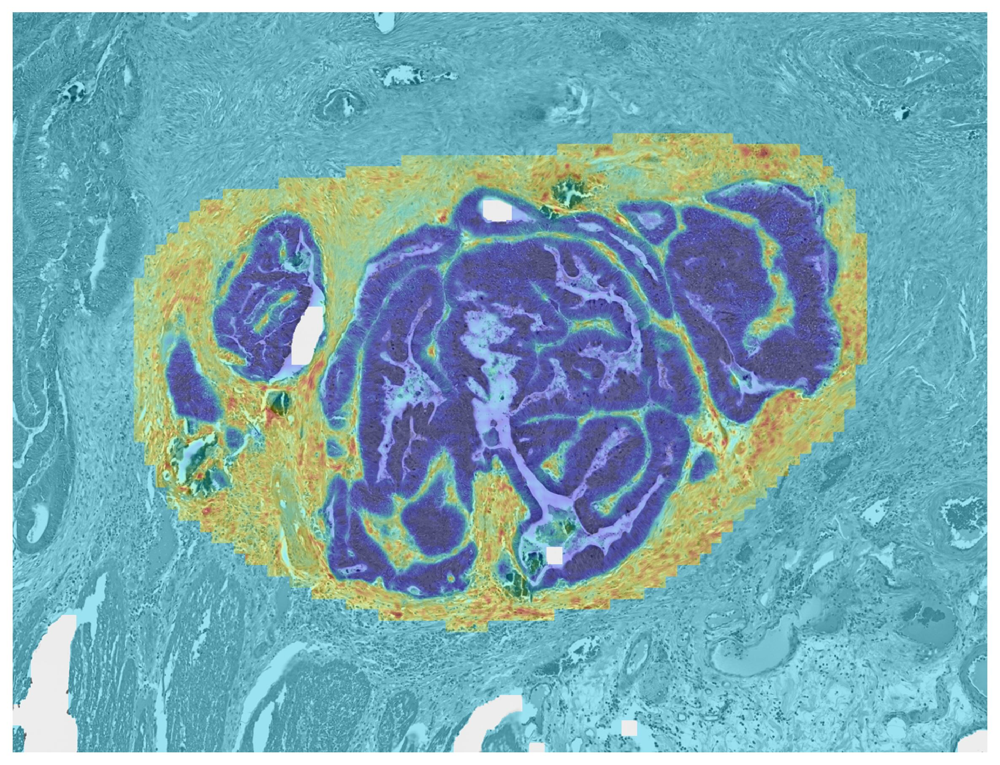

<div align="center">
  
  
  # A plug-and-play foundation model paradigm for multilevel gigapixel phenotyping 
  
  [](https://huggingface.co/collections/tongjideltalab/pasta)
  [](https://hub.docker.com/r/mengflz/pasta)
  [](https://www.python.org/downloads/)
  [](https://pytorch.org/)
  [](LICENSE)

  
</div>

---

## Table of Contents
- [Installation](#installation)
- [Quick Start](#quick-start)
- [Web Interface](#web-interfacebeta)
- [Data Processing](#data-processing)
- [Inference](#inference)
- [Training](#training)
- [Benchmark](#benchmark)
- [Analysis](#analysis)

---

## Installation

### Option 1: Docker Hub (Recommended)

Pull the pre-built Docker image directly from [Docker Hub](https://hub.docker.com/r/mengflz/pasta) (includes all dependencies and code):

```bash
# Pull the latest PASTA image
docker pull mengflz/pasta:latest

# Run demo
docker run --gpus all --shm-size=16g -it --rm \
  mengflz/pasta:latest \
  python demo.py
```

**For Podman users:**

```bash
podman pull mengflz/pasta:latest

podman run --device nvidia.com/gpu=all --shm-size=16g -it --rm \
  mengflz/pasta:latest \
  python demo.py
```

**Docker Compose**

```bash
# Start 
docker-compose up -d
# Stop 
docker-compose down
# View logs
docker-compose logs -f
```

The `docker-compose.yml` file includes:
- GPU support configuration
- Persistent HuggingFace cache volume
- Port mapping for web interface (7860)
- Environment variable support (HF_TOKEN, CUDA_VISIBLE_DEVICES)
- Volume mounts for models, data, and results

To customize settings, create a `.env` file in the project root:
```bash
HF_TOKEN=your_huggingface_token_here
CUDA_VISIBLE_DEVICES=0
HF_ENDPOINT=https://hf-mirror.com
```

### Option 2: Build Docker Image from Source

Clone the repository and build the Docker image locally:

```bash
git clone https://github.com/DELTA-TJ-submission/PASTA.git
cd PASTA

# Build image
docker build -t pasta:latest .

# Run demo 
docker run --gpus all --shm-size=16g -it --rm \
  pasta:latest \
  python demo.py
```

### Option 3: Conda/Pip Installation

Install from source using conda and pip:

```bash
# Clone repository
git clone https://github.com/DELTA-TJ-submission/PASTA.git
cd PASTA

# Create conda environment
conda env create -f environment.yml  
conda activate pasta

# Install PASTA
pip install -e .
```

**Optional:** To leverage GPU acceleration for data processing, we recommend installing [RAPIDS](https://docs.rapids.ai/install/) in your conda environment.

---
### Configuration Requirements

<details>
<summary><b>Hardware Requirements</b></summary>

> *The following specifications are based on our experimental setup and provided as reference.*

- **GPU**: 
  - Training: 2× NVIDIA RTX 4090 (24GB) with bfloat16 precision
  - Inference: 1× NVIDIA RTX 4090 (24GB) 
  - Recommended: ≥24GB VRAM for compatibility with larger backbone models
- **RAM**: 
  - Pixel-level inference (downsample=1, i.e.1:1 ratio WSI prediction): ≥40GB recommended
  - Spot-level inference or higher downsample values: Lower memory footprint
- **Performance**: 
  - Spot-level inference: 2-3 minutes per slide
  - Pixel-level inference: ~2 minutes per gene/pathway  
  *Actual processing times may vary depending on hardware configuration*

</details>

<details>
<summary><b>Software Requirements</b></summary>

- Python 3.10+
- CUDA 12.4+
- PyTorch with CUDA support

</details>

### Hugging Face Configuration

Some foundation models require access permissions from their respective repositories. To use these models:

1. **Obtain access tokens**: Request access to gated models on Hugging Face (e.g., UNI, Virchow)
2. **Configure your token**: Add your Hugging Face token in the config files (`pasta/configs/demo.json` and `pasta/configs/inference.json`):
3. **Using mirror services** (optional): If you need to use a Hugging Face mirror service, update the `endpoint` field:

```json
{
  "huggingface": {
    "token": "hf_your_token_here",
    "endpoint": "https://hf-mirror.com"
  }
}
```

**Note:** The token and endpoint will be automatically applied when loading models that require Hugging Face authentication.

---

## Quick Start

Run the demo pipeline to process a sample WSI `data/demo.ome.tif` and generate predictions:

```bash
python demo.py
```

This will execute the complete workflow:
1. **Patch extraction** from whole slide images (WSI)
2. **H5 file processing** with patch coordinates
3. **Model inference** to generate spatial predictions

The demo uses the configuration in `code/configs/demo.json`. Results will be saved in the `results/demo/` directory:
- `patches/`: Extracted image patches (H5 format)
- `masks/`: Tissue segmentation masks
- `stitches/`: Visualization of patch coordinates
- `predictions/`: Model predictions and visualizations

---

## Web Interface(Beta)

🎨 PASTA now includes a user-friendly web interface for easy prediction  
🚧 *This feature is still a work in progress*

<div align="center">
  
  <p><i>PASTA Web Interface</i></p>
</div>

### Quick Start with Web UI

```bash
# Start the web interface
python web_ui.py
```

Then open your browser and navigate to `http://localhost:7860`

### Features

- 🖱️ **Drag & Drop**: Upload WSI files easily
- 🎯 **Auto-detect Models**: Automatically scans and lists available model weights
- 📊 **Real-time Progress**: Track prediction progress in real-time
- 🎨 **Beautiful Results**: View heatmaps, overlays, and statistics
- 💾 **Easy Download**: Download h5ad files and visualizations
- ⚙️ **Complete Configuration**: Access all prediction parameters through the UI

### Web UI Options

```bash
python web_ui.py [OPTIONS]

Options:
  --host TEXT      Host address (default: 0.0.0.0)
  --port INTEGER   Port number (default: 7860)
  --share          Create public share link for remote access
  --debug          Enable debug mode
```

### Docker with Web UI

```bash
# Run with web interface exposed
docker run --gpus all -p 7860:7860 -it mengflz/pasta:latest python web_ui.py

# For Podman
podman run --device nvidia.com/gpu=all -p 7860:7860 -it mengflz/pasta:latest python web_ui.py
```

📖 For detailed Web UI usage instructions, see [WEB_UI_README.md](WEB_UI_README.md)

---

## Data Processing

### 1. Patch Extraction

Extract patches from whole slide images:

```bash
python -m code.create_patches_fp \
  --source data/wsis \
  --save_dir results/patches \
  --patch_size 256 \
  --step_size 128 \
  --seg --patch --stitch
```

**Key Parameters:**
- `--source`: Directory containing WSI files
- `--save_dir`: Output directory for patches and metadata
- `--patch_size`: Size of extracted patches (default: 256)
- `--step_size`: Stride between patches (default: 256)
- `--seg`: Enable tissue segmentation
- `--patch`: Enable patch extraction
- `--stitch`: Create visualization of patch layout
- `--auto_patch_size`: Automatically adjust patch size based on WSI resolution (MPP)

### 2. H5 File Processing

> 🌟 `inference_without_process.py` can perform inference without the need for h5_file_processing. The script is still in testing.

Process H5 files to extract image data and metadata:

```bash
python -m code.process_patch_h5 \
  --patch_size 256 \
  --h5_path results/patches \
  --slide_path data/wsis \
  --file_type .svs \
  --save_edge \
  --edge_info_path results/edge_info
```

**Key Parameters:**
- `--patch_size`: Patch size for extraction (default: 224)
- `--h5_path`: Directory containing H5 coordinate files
- `--slide_path`: Directory containing original WSI files
- `--file_type`: WSI file extension (`.svs`, `.mrxs`, `.tiff`, `.tif`)
- `--save_edge`: Save bounding box information as JSON
- `--mask_path`: Optional path to GeoJSON mask files for ROI processing
- `--max_workers`: Number of parallel workers (default: 8)

**ROI-based Analysis:**

PASTA supports targeted region-level analysis by ingesting ROI annotations exported from QuPath (GeoJSON/JSON format). This enables focused inference on specific areas of interest to pathologists, reducing computational overhead while enabling precise spatial analysis.

<div align="center">
  
  
  <p><i>Left: ROI annotation in QuPath; Right: Prediction result on selected region</i></p>
</div>

**Processing with ROI masks:**

```bash
python -m code.process_patch_h5 \
  --patch_size 256 \
  --h5_path results/patches \
  --slide_path data/wsis \
  --file_type .svs \
  --mask_path data/masks \
  --save_edge
```

This will create separate H5 files for each ROI defined in the GeoJSON masks.

---

## Inference

> 🌟 `inference_parallel.py` enables parallel processing of multiple WSI slides across multiple GPUs, speeding up inference for large datasets.  

PASTA supports two inference modes:

### 1. Pixel-level Prediction (High-resolution)

Generate high-resolution spatial predictions with visualization:

```bash
python -m code.inference
```

Configure inference in `code/configs/inference.json`:

```json
{
  "inference": {
    "backbone_model_name": "UNI",
    "model_path": "model/UNI_pos_embed.pt",
    "h5_path": "results/patches/",
    "wsi_path": "data/wsis/",
    "output_path": "results/predictions",
    "prediction_mode": "pixel",
    "downsample_size": 10,
    "draw_images": true,
    "save_h5ad": true
  }
}
```

**Key Parameters:**
- `prediction_mode`: Set to `"pixel"` for high-resolution prediction
- `downsample_size`: Downsampling factor for output (default: 10)
- `draw_images`: Generate visualization plots
- `save_h5ad`: Save results in AnnData format
- `save_tiffs`: Export predictions as QuPath-compatible TIFF files
- `selected_pathways`: List of specific pathways to predict (null = all)
- `include_tls`: Include Tertiary Lymphoid Structure (TLS) prediction

### 2. Spot-level Prediction (Low-resolution)

Fast prediction for large datasets:

```json
{
  "inference": {
    "prediction_mode": "spot",
    "output_path": "results/predictions_h5ad"
  }
}
```

Spot-level mode generates patch-level predictions in h5ad format suitable for spatial transcriptomics analysis tools like Scanpy.

### Pathway Configuration

Define pathways in `code/configs/pathways.json`:

```json
{
  "default_14": {
    "names": ["CAF", "Endothelial", "Epithelial", "B_cells", "T_cells", ...],
    "tls_components": ["B_cells", "T_cells"]
  }
}
```

### Visualization Example

PASTA generates high-resolution spatial predictions that can be visualized in QuPath or other pathology viewers:

<div align="center">
  
  <p><i>Interactive visualization of PASTA predictions in QuPath showing detailed spatial patterns at multiple magnifications</i></p>
</div>

The predictions can be exported as:
- **PNG/JPG images** - For quick visualization and presentations (includes both heatmaps and overlays on original H&E images)
- **TIFF files** - QuPath-compatible pyramidal TIFF for interactive exploration
- **H5AD files** - AnnData format for downstream analysis with Scanpy/Squidpy

---

## Training

Train PASTA models using Distributed Data Parallel (DDP):

### Prepare Training Data

PASTA can be trained directly using the [HEST-Library](https://github.com/mahmoodlab/hest) dataset, or you can organize your own training data as follows:

```
data_train/
├── meta.csv                    # Sample metadata
├── patches/                    # H5 files with patches
│   ├── sample001.h5
│   ├── sample002.h5
│   └── ...
└── info_input/
    └── expression/             # Gene expression or pathway scores
        ├── sample001.csv
        ├── sample002.csv
        └── ...
```

**meta.csv format:**
```csv
id
sample001
sample002
...
```

**Expression CSV format:**
Each CSV should contain pathway scores or gene expression values with barcodes/coordinates as index.

### Configure Training

Edit `code/configs/train.json`:

```json
{
  "model": {
    "backbone_model": "UNI",
    "non_negative": false,
    "enable_attention_hooks": false
  },
  "data": {
    "meta_path": "data_train/meta.csv",
    "tile_h5_base": "data_train/patches",
    "info_base": "data_train/info_input",
    "train_ratio": 0.8,
    "random_seed": 42
  },
  "pathway": {
    "info_type": "expression",
    "num_pathways": 14
  },
  "training": {
    "epochs": 100,
    "batch_size": 64,
    "learning_rate": 0.0001,
    "augment": true
  },
  "output": {
    "output_dir": "results/train/UNI"
  }
}
```

### Run Training

Single GPU:

```bash
CUDA_VISIBLE_DEVICES=0 torchrun --nproc_per_node=1 \
  --master_addr="localhost" \
  code/train.py
```

Multi-GPU:

```bash
CUDA_VISIBLE_DEVICES=0,1,2,3 torchrun --nproc_per_node=4 \
  --master_addr="localhost" \
  code/train.py
```

Training outputs:
- Model checkpoints: `results/train/UNI/model_state_dict_*.pth`
- Best model: `results/train/UNI/best_model.pt`
- TensorBoard logs: `results/train/UNI/runs/`
- Train/validation splits: `train_df.csv`, `test_df.csv`

---

## Benchmark

Currently PASTA supports 15 state-of-the-art pathological foundation models:

| Model name | Structure | Layers | Embed size | Params | Dataset | Training recipe |
|------------|-----------|--------|------------|--------|---------|-----------------|
| [CONCH](https://huggingface.co/MahmoodLab/CONCH) | ViT-B/16 | 12 | 768 | 86.6M | 1.17M image-caption pairs | CLIP |
| [Phikon](https://huggingface.co/owkin/phikon) | ViT-B/16 | 12 | 768 | 85.8M | 6,093 slides | iBOT |
| [Phikon v2](https://huggingface.co/owkin/phikon-v2) | ViT-L/16 | 24 | 1024 | 0.3B | PANCAN-XL, 60K slides | DINOv2 |
| [Kaiko-B](https://github.com/kaiko-ai/towards_large_pathology_fms) | ViT-B/8 | 12 | 768 | 85.8M | TCGA | DINO |
| [Kaiko-L](https://github.com/kaiko-ai/towards_large_pathology_fms) | ViT-L/14 | 24 | 1024 | 304.4M | TCGA | DINO |
| [Hibou-B](https://huggingface.co/histai/hibou-b) | ViT-B/14 | 12 | 768 | 85.7M | 1.2B images private dataset | DINOv2 |
| [Hibou-L](https://huggingface.co/histai/hibou-L) | ViT-L/14 | 24 | 1024 | 0.3B | 1.2B images private dataset | DINOv2 |
| [UNI](https://huggingface.co/MahmoodLab/UNI) | ViT-L/16 | 24 | 1024 | 0.3B | 100,426 slides | DINOv2 |
| [UNIv2](https://huggingface.co/MahmoodLab/UNI2-h) | ViT-G/14 | 24 | 1536 | 681M | Over 300k H&E and IHC slides | DINOv2 |
| [Virchow](https://huggingface.co/paige-ai/Virchow) | ViT-H/14 | 32 | 1280 | 632M | 1.5M slides | DINOv2 |
| [Virchow2](https://huggingface.co/paige-ai/Virchow2) | ViT-H/14 | 32 | 1280 | 632M | 3.1M slides | Modified DINOv2 |
| [H-optimus-0](https://huggingface.co/bioptimus/H-optimus-0) | ViT-G/14 | 40 | 1536 | 1.1B | 0.5M slides | iBOT, DINOv2 |
| [H-optimus-1](https://huggingface.co/bioptimus/H-optimus-1) | ViT-G/14 | 40 | 1536 | 1.1B | Over 1M slides | Self-supervised learning |
| [Gigapath](https://huggingface.co/prov-gigapath/prov-gigapath) | ViT-G/16 | 40 | 1536 | 1.13B | 1.3B Providence image tiles | DINOv2 |
| [PLIP](https://huggingface.co/vinid/plip) | ViT-B/32 | 12 | 768 | 87.5M | 208,414 slides paired with descriptions | CLIP |

**Note:** Model download links are provided above. Please refer to the original repos for access to model weights.

---

## Analysis

  This section will include:
  - Basic analysis like real ST data
  - Cell-level aggregation with cell segmentation methods
  - Visualization tools
  - Archetypes identification
  - (to be continue)
  
---

## License

Our code and model weights are released under the Apache License 2.0. See [LICENSE](LICENSE) for additional details.

---

## Citation

If you find this repository useful, please consider giving a star ⭐ and citation:

```bibtex
@software{PASTA,
  author = {Fangliangzi Meng},
  title = {A plug-and-play foundation model paradigm for multilevel gigapixel phenotyping},
  url = {https://github.com/DELTA-TJ-submission/PASTA},
  year = {2025},
}
```

---

## Contact

For questions and issues, please:
- Open an issue on GitHub
- Contact: mengflz@tongji.edu.cn

---

## Acknowledgments

This project builds upon several excellent works:
- [CLAM](https://github.com/mahmoodlab/CLAM) for WSI processing utilities
- Foundation models from various research groups (see Benchmark section)
- [HEST](https://github.com/mahmoodlab/HEST) for WSI and paired ST dataset
- [DPT](https://github.com/isl-org/DPT) for model inspiration
- [Achetypal-analysis](https://github.com/atmguille/archetypal-analysis) for AA implement
